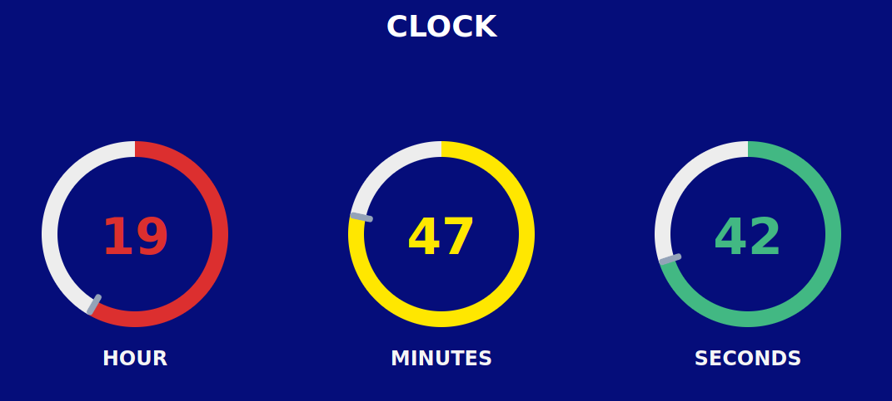

# <h1 style="text-align: center"> Clock React Tailwind 👋 </h1>

 

 	
  	
  	
  	

##

## 
Clock

Este es un simple reloj usando **React** y unos graficos de dona, o graficos circulares, el mismo es responsive.
 
Posee una vista amigable tanto en dispositivos moviles como desktop
 
Aqui tienes una imagen en un formato desktop
 

 
Te dejo una **<a href="https://clock-react-tailwindcss.netlify.app/" target="_black">demo</a>** del mimo si quieres verla.

##

## Licencia

 
El proyecto Clock React Tailwind esta autorizado bajo la licencia MIT. Sientete libre de usar y modificarlo segun tus necesidades.
